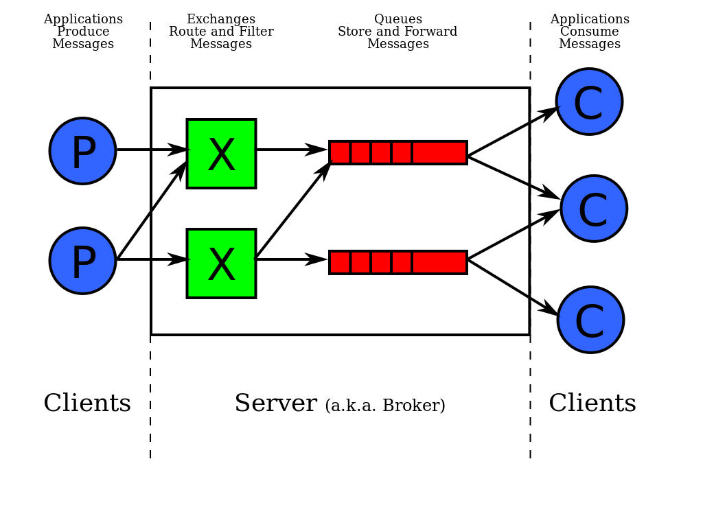

##	Messaging Protocol:

*	A Message Queueing system receives, stores and forwards messages.
*	Publish/Subscribe is a messaging pattern that aims to decouple the sending (Publisher) and receiving (Subscriber) party.
*	a message broker is an intermediary program module that translates a message from the formal messaging protocol of
	the sender to the formal messaging protocol of the receiver.
*	Publishers and Subscribers don't require to know each other.
*	MQTT stands for Message Queue Telemetry Transport.
*	It is a publish/subscribe, extremely simple and lightweight messaging protocol.
*	minimise network bandwidth(low-bandwidth)
*	TCP/IP port 1883 is registered with MQTT
*	TCP/IP port 8883 is also registered with MQTT over SSL.
*	Data distribution Supports 1 to zero, 1 to 1, and 1 to n
*	It transfers data content as byte array.
*	Bidirectional messaging
*	Determinable delivery of messages
*	message-delivery guarantees such as at-most-once, at-least-once and exactly-once.
*	VerneMQ is a high-performance, distributed MQTT broker. 
*	Mosquitto is an open source message broker that implements the MQTT protocol 
*	AMQP, Advanced Message Queueing Protocol
*	JMS, Java Messaging Service
*	XMPP, Extensible Messaging and Presence Protocol.
*	STOMP is the Simple (or Streaming) Text Orientated Messaging Protocol.
*	MQTT is devised by IBM 
*	AMQP is devised by JPMorgan.
*	RabbitMQ is the most popular open source message broker.
*	RabbitMQ stores and forwards binary blobs of data.

##	Basic concepts of MQTT

*	Publish/subscribe
*	Topics and subscriptions
*	Quality of service levels
*	Retained messages
*	Clean sessions and durable connections
*	Wills


## install vernemq:
```js
	download and upload bed file to server
	https://vernemq.com/downloads/
	sudo dpkg -i vernemq_1.3.2-1_amd64.deb
	dpkg -s vernemq | grep Status
	service vernemq start
	
	add Authentication in vernemq
		vmq-passwd -c /etc/vernemq/vmq.passwd USERNAME
		and enter password it will add user in /etc/vernemq/vmq.passwd with encrypted password
		
		to delete user 
			vmq-passwd -D /etc/vernemq/vmq.passwd USERNAME
	
	nano /etc/vernemq/vernemq.conf
		listener.ws.default = 0.0.0.0:2082
		listener.wss.default = 0.0.0.0:2083
		listener.tcp.default = 0.0.0.0:2052
	
	service vernemq restart
	
	for testing mqtt connection
		http://hobbyquaker.github.io/mqtt-admin/
		http://www.hivemq.com/demos/websocket-client/
	
	for adding self sign certificate for wss
		add directory in ssl for vernemq
			cd /etc/ssl
			mkdir vernemq
			cd vernemq
			
		generate certificates
			while creting certificate enter fill all details and in commonname put domain name like *.DOMAIN.COM
			
			openssl req -new -x509 -days 3650 -extensions v3_ca -keyout ca.key -out ca.crt
			openssl genrsa -des3 -out server.key 2048
			openssl genrsa -out server.key 2048
			openssl req -out server.csr -key server.key -new
			openssl x509 -req -in server.csr -CA ca.crt -CAkey ca.key -CAcreateserial -out server.crt -days 3650
			openssl genrsa -des3 -out client.key 2048
			openssl req -out client.csr -key client.key -new
			openssl x509 -req -in client.csr -CA ca.crt -CAkey ca.key -CAcreateserial -out client.crt -days 3650
	
	add certificate in conf file for wss
		nano /etc/vernemq/vernemq.conf
		
		uncomment this line and add certificate	
			listener.wss.cafile = /etc/ssl/vernemq/ca.crt
			listener.wss.certfile = /etc/ssl/vernemq/server.crt
			listener.wss.keyfile = /etc/ssl/vernemq/server.key
		
		service vernemq restart
```
